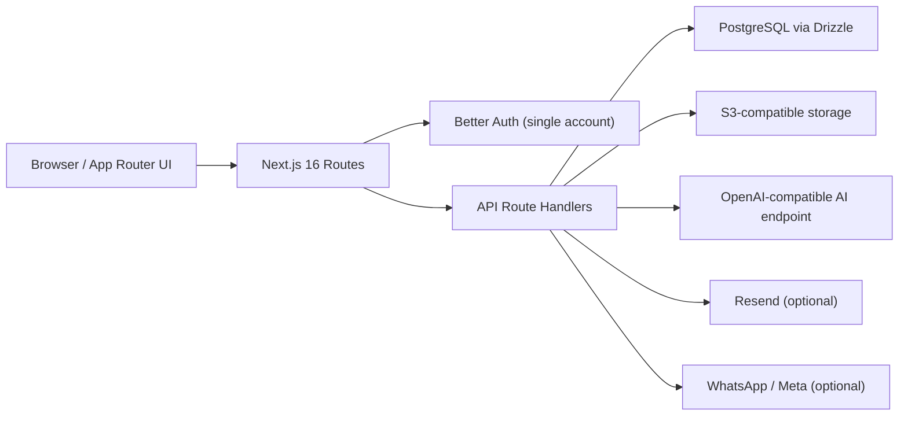

# Architecture

Pax is a single Next.js application with route groups for marketing, auth, and
the authenticated app. It is designed to be self-hosted by one person: the
instance holds exactly one account, and all state lives in infrastructure the
owner controls.

Persistent state lives in PostgreSQL through Drizzle. Files are stored in any
S3-compatible object storage. The assistant uses an OpenAI-compatible provider
and retrieves context with PostgreSQL full-text search.

## Notes

- The app builds two ways: `next build` for Node/Vercel/Docker, and
  `vinext build` for Cloudflare Workers. `worker/index.ts` is the Workers
  entry and adds the cron `scheduled` handler for reminders.
- `src/proxy.ts` handles auth redirects and request ID propagation.
- `src/lib/access.ts` enforces session and single-owner LLC access.
- `src/lib/ai-config.ts` resolves the AI provider: environment defaults with an
  in-app database override.
- `src/lib/knowledge.ts` performs Postgres full-text retrieval and citation
  building.
- `src/lib/internal-auth.ts` guards the internal reminder endpoints for cron.
- `src/lib/feature-flags.ts` is deploy-time feature flagging.
- `/api/health` and `/api/metrics` are the current runtime health surfaces.
