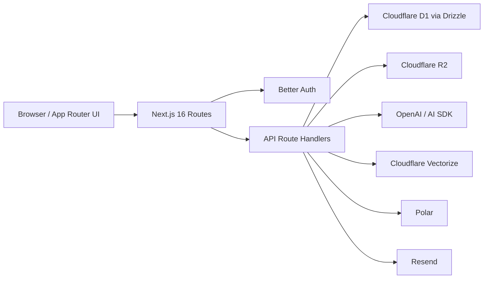

# Architecture

Startup OS is a single Next.js application with route groups for marketing, auth, and the authenticated app. Persistent state lives in Cloudflare D1 through Drizzle. Files are stored in R2. Retrieval-augmented assistant features use OpenAI embeddings and can sync vectors into Cloudflare Vectorize.

## Notes

- `src/proxy.ts` handles auth redirects and request ID propagation.
- `src/lib/feature-gate.ts` is plan gating.
- `src/lib/feature-flags.ts` is deploy-time feature flagging.
- `/api/health` and `/api/metrics` are the current runtime health surfaces.
