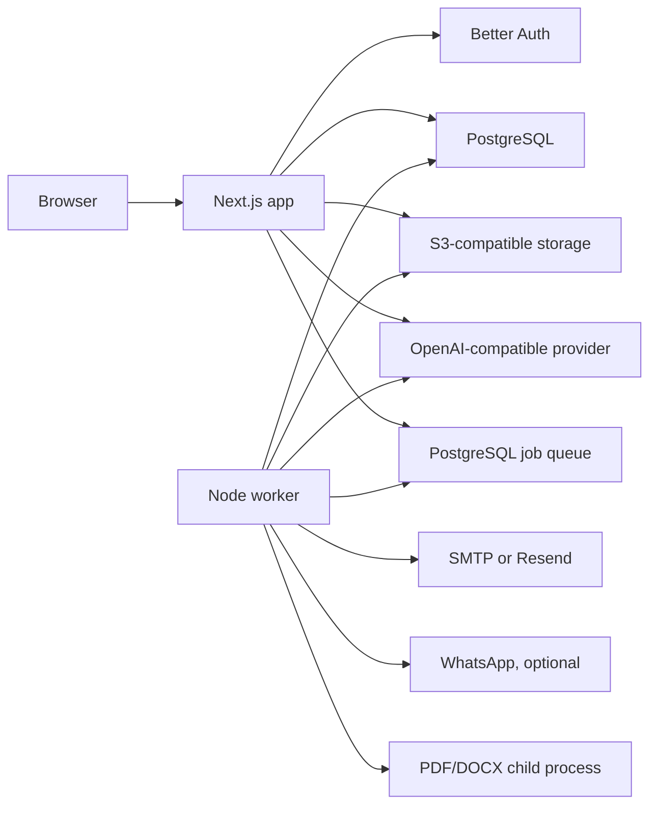

# Architecture

Pax is a self-hosted, single-user application. One PostgreSQL database holds
one owner account and that owner's entities. The code and documentation do not
assume a future hosted customer model.

The web application uses Next.js 16 and Better Auth. PostgreSQL stores
application state and the durable job queue. Vault files live in S3-compatible
object storage. The assistant calls an OpenAI-compatible provider and retrieves
context through PostgreSQL full-text search.

## Web and worker boundary

HTTP routes validate access, record consent, and enqueue work. They do not
parse documents or deliver reminders. `scripts/worker.ts` claims one job at a
time using a lease and handles document analysis, reminder delivery, object
cleanup, expiry, and retention.

PDF and DOCX parsing runs in a child process with a 128 MB V8 heap limit and a
30-second timeout. The heap setting is not a total memory limit. The production
Compose file gives the worker container a 512 MB limit, which also covers child
processes.

The web app can run on Node, Vercel, or Cloudflare Workers. Document analysis,
reminder delivery, and cleanup still require the separate Node worker.

## Document privacy

The browser encrypts ordinary vault uploads before storage. The server does not
decrypt that vault copy. Analysis is a separate opt-in flow:

1. The browser submits a readable copy after showing the disclosure.
2. The server encrypts that temporary copy with `DATA_ENCRYPTION_KEY`.
3. The worker decrypts it, extracts text, and may send content to the configured
   AI provider.
4. Searchable extracted text and analysis remain readable by the server for up
   to 30 days.
5. Revocation removes derived data and prevents an old job lease from writing
   it back.

Cleanup depends on a running worker and working object storage. Operators should
also configure a one-day lifecycle rule for the `processing/` prefix.

## Sensitive server records

`DATA_ENCRYPTION_KEY` protects job payloads, filing snapshots, transaction
facts, review notes, and the stored AI API key. This server-side encryption is
separate from the client vault keys.

Filing rules are deterministic and versioned in
`src/modules/compliance/deadlines.ts`. User review freezes an encrypted
assessment snapshot. Removing a transaction affects future snapshots only.

## Runtime surfaces

- `src/proxy.ts` handles auth redirects and request ID propagation.
- `src/lib/access.ts` and `src/lib/route-guards.ts` enforce owner access.
- `src/lib/ai-config.ts` resolves environment defaults and the encrypted
  database override.
- `src/lib/knowledge.ts` handles full-text retrieval and citations.
- `/api/health` is the liveness endpoint.
- `/api/health?deep=true` checks PostgreSQL, storage, and worker recency when
  called with the internal secret.
- `/api/operations` exposes sanitized worker and failed-job status to the owner.
- `/api/metrics` exposes the existing process metrics.

See [operations.md](operations.md) for deployment, retry, backup, and restore
procedures.
